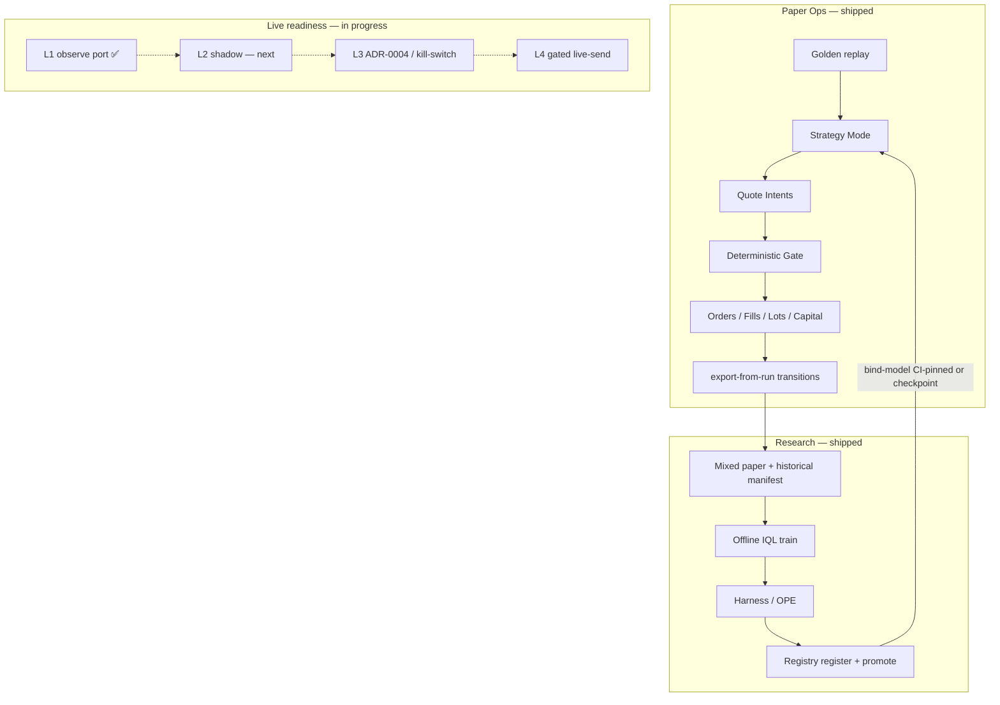

# Master overview — Sneaker Market Maker

**Start here.** This repo is a **sneaker market-making system** (StockX-first):
continuous two-sided quoting, fee-aware risk, offline policy learning, and a
gated path from paper execution toward live readiness. Paper trading is the
**current safe execution and training loop** — not the whole product scope.

**Progress (2026-07-18):** Research↔paper loop **closed** (R0–R4). Live readiness
**L1** (read-only observe) shipped. Next: L2 shadow → L3 ADR-0004 — **live order
send still off**. See [`ROADMAP.md`](ROADMAP.md).

**Glossary (canonical terms):** [`CONTEXT.md`](../CONTEXT.md)  
**Paper Ops (tick → fill):** [`docs/paper-ops/`](paper-ops/README.md)  
**Research math / layers:** [`docs/research/junior-walkthrough.md`](research/junior-walkthrough.md),
[`QUANTITATIVE_CONTEXT.md`](research/QUANTITATIVE_CONTEXT.md),
[`iql-code-walkthrough.md`](research/iql-code-walkthrough.md)

---

## 1. What is market making?

A **market maker** posts both sides of a market so others can trade:

- **Bid** — price they are willing to **buy** at  
- **Ask** — price they are willing to **sell** at  

They earn the **spread** (ask − bid) when both sides trade, and manage **inventory**
and **fees** so they are not stuck holding losing stock.

On a sneaker secondary marketplace (StockX-shaped), “quotes” are offers against
observed **highest bid** / **lowest ask** for a specific product (style, size).
A continuous market maker keeps revising those quotes as the book moves —
not a one-shot “place and forget.”

In this project that posture is **Two-Sided Quoting** (paper today; live later
behind ADR-0004): keep a healthy bid when quoting is on; post an ask only when
an **Inventory Lot** is available to sell (inventory-backed ask). Flat inventory
with no ask is allowed.

---

## 2. What this project is (and is not)

### Product scope (full system)

| Pillar | Meaning |
|--------|---------|
| **Market making** | Continuous two-sided quoting under allowlist, capital, fees, and a **Deterministic Gate** that is always final |
| **Paper execution (shipped)** | Continuous Paper Market-Maker Ops: golden replay → Strategy Modes → Gate → Decimal capital / fills / lots |
| **Learning loop (shipped)** | Paper/history → OfflineTransitions → offline IQL train/eval → registry promote → bind real weights into Ops |
| **Live readiness (in progress)** | Read-only observe (L1) → shadow would-quote (L2) → kill-switch + ADR-0004 (L3) → tiny human-gated live-send (L4) |

| Area | Detail |
|------|--------|
| **StockX Historical Replay** | Authoritative market events for paper execution proof — golden dataset today |
| **Product-Family Allowlist** | Jordan 1 Retro and Nike Dunk Low only (expand only via explicit allowlist/ADR) |
| **Strategy Modes** | `deterministic` \| `advisory` \| `iql_primary` — Gate always final; demo binds CI-pinned IQL |
| **Ops Dashboard** | Operator UI for replay + mode + projections (`/?view=ops`) |
| **Offline research stack** | Episodes, fee-once rewards, transitions, evaluation/OPE, registry, shadow/advisory recommender |
| **Read-only observe (L1)** | Allowlisted StockX-shaped observations — **no order send** |

### Explicitly not done / not allowed (yet)

- **Live order send** without ADR-0004 + human enable (default off)  
- Bypassing marketplace protections, CAPTCHA, or anti-bot tooling  
- Ungated model trading (model never overrides the Deterministic Gate)  
- PFHedge as a **Strategy Mode** on the quote path (deferred — ADR-0005; research comparison only)  
- Discord/Slack alerts, Prometheus/Grafana as ship requirements  
- Multi-quantity tickets driven by model “allocation”  

Paper is how we **prove and train** market-making behavior safely. The roadmap’s
live track is how we **rehearse and eventually send** under the same Gate DNA.

---

## 3. Three pillars: paper execution, learning, live readiness



| Pillar | What you do with it |
|--------|---------------------|
| **Paper Ops** | Run continuous market-making under replay; promote/bind IQL; export transitions |
| **Research** | Train/compare policies; register artifacts; PFHedge stays comparison-only (ADR-0005) |
| **Live readiness** | Observe allowlisted books (L1); rehearse then send only after ADR-0004 |

**PFHedge:** research comparison baseline only — not a Strategy Mode on the quote
path ([ADR-0005](adr/0005-pfhedge-paper-mode-deferred.md)).

---

## 4. Toy market-making flow (teaching dollars)

Imagine Jordan 1 Retro size 10. Paper Capital starts at **\$2,500**.

| Step | What happens | Toy numbers |
|------|----------------|-------------|
| 1. Book | Market shows bid/ask | Highest bid \$200, lowest ask \$250 |
| 2. We bid | Deterministic Strategy places a buy **\$1 under** touch | Bid \$199 (qty **one**) |
| 3. Fill | Ask comes to us → Fee-Aware Fill | Pay ~\$199 + fees/shipping → cash down; **Inventory Lot** purchased |
| 4. Available | Lot clears logistics/auth in paper lifecycle | Lot state → available |
| 5. We ask | Now inventory-backed ask | Ask above our cost / near touch |
| 6. Sell fill | Someone hits our ask | Cash up; lot sold; **realized P&L** after fees |

**Why qty one?** One physical pair per Paper Order — allocation from models does
not invent multi-pair tickets.

**Why the Gate?** Every place/revise/cancel/replace is checked for allowlist,
capital reserve (open buys ≤ \$1,500 of initial), cash, and inventory rules.

---

## 5. Golden dataset walkthrough (real touches)

Dataset `golden-stockx-v1` (`data/paper/golden_v1/`), allowlisted families only.

| Event | Product | Highest bid | Lowest ask | Teaching point |
|-------|---------|-------------|------------|----------------|
| `g1` | Jordan 1 Retro `555088-001` / 10 | \$220 | \$275 | Wide spread — room to quote a bid under the ask |
| `g2` | Same SKU | \$220 | \$221 | Tight book — buy at \$221 can fill against ask |
| `g3` | Nike Dunk Low `DD1391-100` / 9 | \$110 | \$145 | Second allowlisted family |

**Ops happy path (deterministic):** load → start → enable → tick. Default
Deterministic Strategy bids about **touch + \$1** on the bid side (e.g. \$221 on
`g1`). Later ticks can fill and create lots. Details:
[`docs/paper-ops/junior-e2e-flow.md`](paper-ops/junior-e2e-flow.md).

---

## 6. What is IQL? (intuition + examples)

**IQL** (Implicit Q-Learning) here is an **offline** reinforcement-learning policy:
it learns from logged historical decisions, not by freely exploring a live market.

In this repo the custom path is **distributional IQL** (learns a return
distribution, not only a mean). Training, losses, and OPE live in the research
docs — this section only explains what the **action** looks like when it reaches paper.

### HybridAction (research action vocabulary)

| Field | Role |
|-------|------|
| `category` | `NO_OP` \| `QUOTE` \| `CANCEL` |
| `allocation` | Continuous [0,1] in research — **ignored for Paper Order size** (always qty 1) |
| `bid_offset_ticks` / `ask_offset_ticks` | Integer tick offsets |

**Action Translator** maps that into paper prices using a pinned `tick_size`
(default \$1.00 in the paper bridge):

- `QUOTE` → prices from touch (or advisory base) ± ticks × tick_size  
- `CANCEL` → cancel actives through the Gate  
- `NO_OP` → emit no new intents  

### Examples

**Idle (sit out the tick)**

```text
category=NO_OP  allocation=0  bid_ticks=0  ask_ticks=0
→ no new Quote Intents
```

**Aggressive buy skew (IQL-primary from market touch \$220 / \$275)**

```text
category=QUOTE  allocation=0.5  bid_ticks=+3  ask_ticks=-3
→ bid $223, ask $272  (still must pass Deterministic Gate; ask only if lot available)
```

**Advisory nudge (deterministic base bid \$221, then +2 ticks)**

```text
Deterministic base bid = $221
IQL bid_ticks=+2  → nudged bid $223
Late/invalid IQL → keep $221 for that tick (fallback); replay keeps running
```

**IQL-primary failure**

```text
Missing / timeout / invalid inference while mode=iql_primary
→ pause StockX Historical Replay (pause_reason=iql_unavailable)
→ do NOT silently switch to Deterministic Strategy while claiming iql_primary
```

Deeper math: [`QUANTITATIVE_CONTEXT.md`](research/QUANTITATIVE_CONTEXT.md),
[`junior-walkthrough.md`](research/junior-walkthrough.md) (IQL layer).
**Code + Ops bind + PyTorch actor tutorial:**
[`iql-code-walkthrough.md`](research/iql-code-walkthrough.md).

---

## 7. Strategy Modes (one page)

| Mode | Who authors desired quotes | If IQL fails |
|------|----------------------------|--------------|
| `deterministic` | Deterministic Strategy only | N/A — IQL not called |
| `advisory` | Deterministic base + bounded IQL nudge | Deterministic base that tick; **no pause** |
| `iql_primary` | IQL via Action Translator | **Pause** replay until healthy IQL or mode switch |

**Model Qualification:** `advisory` needs registry `advisory_approved`;
`iql_primary` needs at least `benchmark_qualified`. `deterministic` always allowed.

Gate remains final in every mode.

---

## 8. Where to go next

| Goal | Doc |
|------|-----|
| Term definitions | [`CONTEXT.md`](../CONTEXT.md) |
| Paper tick → fill, modules | [`paper-ops/junior-e2e-flow.md`](paper-ops/junior-e2e-flow.md) |
| Run Ops / commands | [`paper-ops/operator-cheat-sheet.md`](paper-ops/operator-cheat-sheet.md) |
| Bind / qualify registry artifact | [`paper-ops/bind-qualify-runbook.md`](paper-ops/bind-qualify-runbook.md) |
| Observe-only market data (L1) | [`observe/README.md`](observe/README.md) |
| Audit events / projections | [`paper-ops/auditor-reconstructibility.md`](paper-ops/auditor-reconstructibility.md) |
| Research stack end-to-end | [`research/junior-walkthrough.md`](research/junior-walkthrough.md) |
| **Senior architect blueprint** | [`research/senior-architect-walkthrough.md`](research/senior-architect-walkthrough.md) |
| **Exercise research pipeline** | [`research/exercise-pipeline.md`](research/exercise-pipeline.md) |
| Deep quantitative context | [`research/QUANTITATIVE_CONTEXT.md`](research/QUANTITATIVE_CONTEXT.md) |
| **IQL code + paper bind + actor/PyTorch** | [`research/iql-code-walkthrough.md`](research/iql-code-walkthrough.md) |
| Why golden replay / deterministic-first / Gate-final IQL | ADRs [`0001`](adr/0001-golden-historical-replay-for-v1.md), [`0002`](adr/0002-deterministic-first-paper-mm.md), [`0003`](adr/0003-iql-strategy-modes-gate-final.md) |
| PFHedge paper mode deferred | ADR [`0005`](adr/0005-pfhedge-paper-mode-deferred.md) |
| **Roadmap (research loop + live readiness)** | [`ROADMAP.md`](ROADMAP.md) · [dual-track spec](superpowers/specs/2026-07-18-dual-track-roadmap.md) |

**Local surfaces**

| URL | Surface |
|-----|---------|
| http://127.0.0.1:5173/?view=ops | Paper Ops |
| http://127.0.0.1:5173/ | Guided demo (fixture story — not paper authority) |
| http://127.0.0.1:5173/?view=research | Research comparison |
| http://127.0.0.1:8000/docs | API Swagger |
