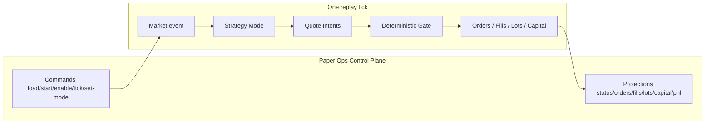
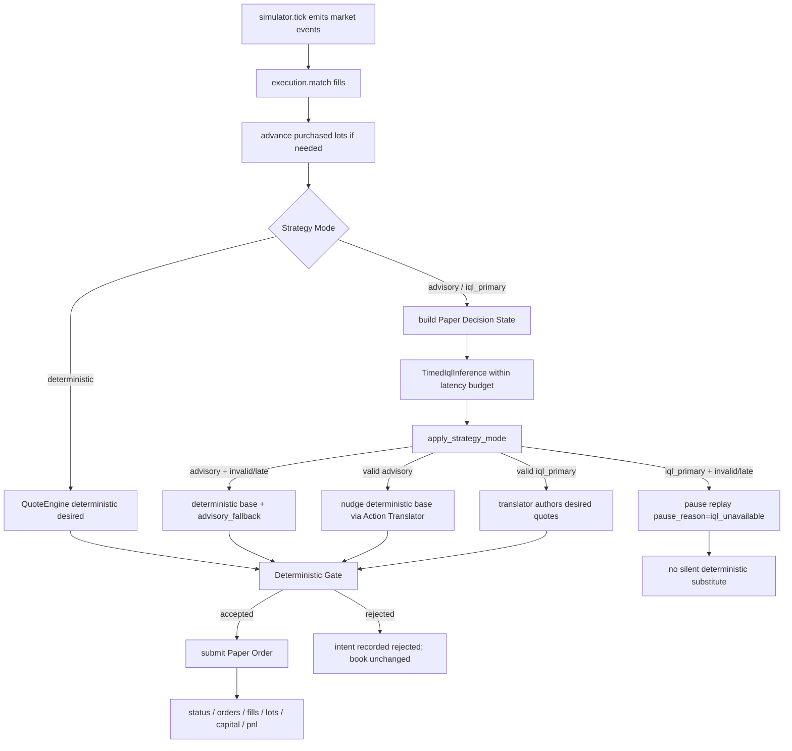

# Junior E2E flow — Continuous Paper Market-Maker

How a **StockX Historical Replay** tick becomes Paper Orders, Fee-Aware Fills,
Inventory Lots, and Paper Capital under **Strategy Mode**, with the
**Deterministic Gate** always final.

**Audience:** new contributors.  
**Canonical scenario:** Golden Historical Replay Dataset `golden_v1`. Local demo /
acceptance can use the **CI-pinned IQL** artifact for `advisory` / `iql_primary`
(stubs remain injectable for unit tests only).  
**Glossary:** [`CONTEXT.md`](../../CONTEXT.md).  
**Siblings:** [operator cheat sheet](./operator-cheat-sheet.md),
[auditor reconstructibility](./auditor-reconstructibility.md),
[bind/qualify runbook](./bind-qualify-runbook.md).  
**IQL code + actor (how bind works under the hood):**
[`../research/iql-code-walkthrough.md`](../research/iql-code-walkthrough.md).

This is **not** the Guided Demo (fixture story at `/?`) and **not** the research
comparison page (`/?view=research`).

---

## Big picture

Exactly one **Strategy Mode** is active: `deterministic` | `advisory` |
`iql_primary`. Models may author or nudge intents; they never approve orders.

---

## Happy path — golden_v1 deterministic

1. **Load** the Golden Historical Replay Dataset (`data/paper/golden_v1/`).
2. **Start** the replay clock; **enable** the Deterministic Strategy.
3. **Tick** once or more. For each market event in the batch:
   - Match open Paper Orders against the event → Fee-Aware Fills.
   - Advance purchased Inventory Lots toward available-for-sale when rules allow.
   - Build desired two-sided quotes (bid from touch; ask only with inventory).
   - Emit Quote Intents (place / replace / cancel) through the Deterministic Gate.
   - Accepted intents become Paper Orders; capital reservations update.
4. Read **projections**: cash ≠ initial after a buy fill; lots appear; P&L updates.

With seed `7` and speed `1`, three ticks on `golden_v1` place → fill → continue
quoting (see `tests/api/test_paper_ops_api.py`).

Default Strategy Mode is **deterministic**: **no IQL call** on the tick path.

---

## One-tick flowchart (all modes)

---

## Strategy Mode branches (real or CI-pinned IQL)

### `advisory` (needs registry `advisory_approved`)

- Deterministic Strategy proposes the **base** desired bid/ask.
- Valid IQL within budget → Action Translator applies a **bounded tick nudge**
  from that base → Gate.
- Missing / late / invalid IQL → **deterministic base for that tick only**;
  replay stays **running**; `fallback_reason` set (e.g. `timeout`).

### `iql_primary` (needs at least `benchmark_qualified`)

- Valid IQL → Action Translator authors desired quotes from market touch → Gate.
- Missing / late / invalid → **pause** StockX Historical Replay with
  `pause_reason = iql_unavailable` — **no** silent deterministic substitute.
- Recovery:
  - Switch mode to `deterministic`, then **resume**, or
  - Restore healthy IQL, then **resume** (probe uses last market event).

### Model Qualification

Unqualified `set-mode` fails closed: mode unchanged, `strategy.mode_rejected`.
`deterministic` is always allowed. Local demo pre-binds CI-pinned weights as
`advisory_approved` — see [bind-qualify-runbook.md](./bind-qualify-runbook.md).

---

## Stage → module map

| Stage | Module(s) |
|-------|-----------|
| Ops REST + WS | `api/paper_routes.py`, `api/paper_events.py`, `api/local_demo.py` |
| Session / tick orchestration | `paper/session.py` |
| Mode + latency budget + bind / promote | `paper/ops_mode.py`, `paper/strategy_mode.py`, `paper/artifact_bind.py`, `paper/promote.py` |
| Replay clock + golden load | `paper/replay/simulator.py`, `paper/replay/loader.py` |
| Paper Decision State | `paper/decision_state.py` |
| IQL inference port + budget | `paper/inference.py` (production: `CheckpointIqlInference`) |
| Mode authorship / nudge / fallback / pause signal | `paper/mode_path.py` |
| Action Translator | `paper/action_translator.py` |
| Deterministic desired quotes + reconcile | `paper/quote_engine.py` |
| Deterministic Gate | `paper/gate.py` |
| Orders / matching / Fee-Aware Fills | `paper/execution.py`, `paper/orders.py` |
| Inventory Lots | `paper/inventory.py` |
| Paper Capital | `paper/capital.py` |
| Read models | `paper/projections.py` |
| Allowlist | `paper/allowlist.py` |
| Paper → transition export | `paper/export_transitions.py`, `paper/step_effects.py`, … |
| Store / audit persistence | `persistence/paper_*.py` |
| Ops UI | `frontend/src/ops/*` |

Acceptance seams: `tests/api/test_paper_ops_api.py`,
`tests/api/test_paper_ops_strategy_modes.py`,
`tests/api/test_paper_ops_deterministic_mode.py`,
`tests/api/test_paper_ops_r3_bind.py`,
`tests/api/test_paper_ops_r4_promote.py`.

---

## What this flow deliberately excludes

- Guided Demo / research comparison as paper authority
- PFHedge as a paper Strategy Mode (ADR-0005)
- Live marketplace order adapters (L1 observe is separate — [`../observe/`](../observe/README.md))
- Ungated model trading / Gate override
- Multi-quantity Paper Orders from IQL allocation