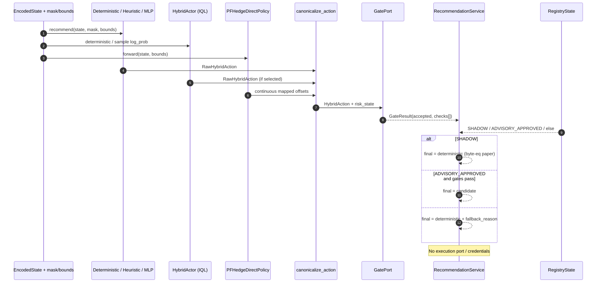
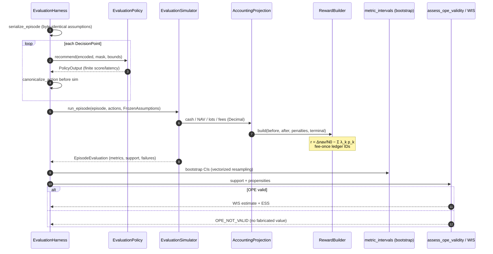
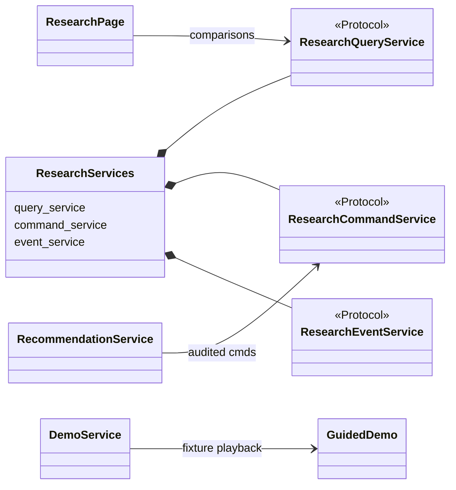

# Quantitative Context Document — Sneaker Market Maker Research Engine

**Workspace:** `sneaker_market_maker` / worktree `deep-bellman-pfhedge`  
**Scope date:** 2026-07-17  
**Audience:** Quantitative software architects, researchers, and senior implementers  

This blueprint describes the **as-built** system: a fee-aware analytics core plus an
**offline** distributional IQL research track and an independent PFHedge 0.23.0
direct-hedging baseline, governed by an immutable registry and deterministic risk
gates. It is **not** a live marketplace execution engine.

---

## SECTION 1: EXECUTIVE SUMMARY, OBJECTIVE, AND ASSUMPTIONS

### 1.1 Core Objective

The engine solves an **offline market-making research and governance** problem for
sneaker secondary markets (StockX-first paper world):

1. **Normalize** marketplace-like observations into fail-closed, fee-aware state.  
2. **Construct** leakage-safe 14-day decision episodes and Bellman-ready transitions
   with exact (Decimal) accounting.  
3. **Train / compare** policies under identical frozen simulator assumptions:
   deterministic / heuristic / v1 MLP / **PFHedge direct baseline** /
   **custom risk-sensitive distributional IQL**.  
4. **Evaluate honestly** with walk-forward folds and support-gated OPE (WIS only
   when fully valid).  
5. **Serve recommendations only** (shadow → optional advisory) where
   **deterministic gates remain the final authority** over paper commands.

Financial objective of the learned / baseline policies (research): improve
risk-adjusted paper NAV under fee, slippage, logistics, inventory, and capital
constraints — **without** placing live orders.

### 1.2 Hard Mathematical & Domain Assumptions

| Domain | Assumption (as encoded) |
|--------|-------------------------|
| **Market microstructure** | Discrete secondary-market bid/ask + recent sales; no LOB reconstruction; no continuous double-auction matching engine. |
| **Decision frequency** | Material events **or** coalesced **60 s** simulation-time maintenance ticks inside a fixed **14-day** episode. Not tick-by-tick HFT. |
| **Liquidity** | Risk limits require minimum 48h sales count and reject excessive volatility ratios (`RiskLimits`); masks can disable `QUOTE` when inventory/capital state forbids it. |
| **Transaction costs** | Explicit `FeeSchedule` + reward explanatory costs (seller, processor, shipping, authentication, slippage). Fee-once ledger reconciliation. |
| **Slippage / logistics** | Versioned frozen assumption strings (`slippage_version`, `logistics_version`); costs enter NAV projections, not ad-hoc floats in the actor. |
| **Price stress (synthetic)** | Vectorized GBM for holding-period stress only; discrete multiplicative shocks for restock/hype. GBM is **not** a claim of return normality. |
| **Stationarity** | **Not assumed globally.** Walk-forward folds + frozen assumption hashes bound non-stationarity; synthetic never substitutes for historical holdout claims. |
| **Discounting** | Continuous-time style per-step \(\gamma_t=\exp(-\rho\Delta t_t)\) (or versioned fixed \(\gamma\)); stored on each transition. |
| **Offline RL** | IQL fits on **logged** actions only; no online environment interaction in training. |
| **OPE** | WIS requires full action support + trustworthy joint propensities; otherwise `OPE_NOT_VALID`. |
| **NaN / non-finite** | Fail closed: encoding, networks, trainer, OPE, and checkpoints raise on non-finite tensors; Decimal paths reject non-finite money. |
| **Look-ahead** | Scalers fit on train split only; folds isolate chronology and provenance; episode serialization hashed under frozen assumptions. |

### 1.3 System Operational Constraints

| Constraint | As-built bound / practice |
|------------|---------------------------|
| **Execution latency** | No live venue latency SLA. Research records `PolicyOutput.latency_ms` and `FrozenAssumptions.latency_ms` for timeout fail-closed serving. Default demo / local API on loopback. |
| **Serving timeout** | Recommendation service uses injected clock; elapsed \(\ge\) deadline → deterministic fallback. |
| **Memory** | No hard matrix RAM ceiling in code. Practical: episode tensors and IQL batches held in process memory; checkpoints via safetensors on disk; Postgres for transition metadata. |
| **Concurrency** | Training jobs intended **outside** request path. FastAPI research API: idempotent commands + ordered WebSocket sequences; default bind `127.0.0.1`. |
| **Network** | Offline-by-policy: safety AST audits + `socket.connect` denial in research smoke tests. No marketplace SDK. |
| **Persistence** | Append-only transitions; corrections supersede via new versions — no silent overwrite. |
| **Python matrix** | 3.10–3.12; PFHedge 0.23.0 pin documented. |

---

## SECTION 2: SYSTEM INTERACTION (SEQUENCE DIAGRAMS)

### 2.1 Ingestion & Pre-processing Cycle

Raw marketplace-shaped JSON / normalized replay → validated state → tensors + masks.

```mermaid
sequenceDiagram
    autonumber
    participant Feed as Raw feed / fixtures
    participant Pipe as SneakerDataPipeline
    participant Snap as MarketSnapshot (Decimal)
    participant Evt as NormalizedEvent stream
    participant EB as EpisodeBuilder
    participant Enc as StateEncoder + Scaler
    participant Mask as MaskBuilder
    participant Store as TransitionRepository

    Feed->>Pipe: parse_payload(JSON)
    Note over Pipe: Fail-closed PayloadError<br/>no silent NaN fill
    Pipe->>Snap: MarketSnapshot + fee rate
    Pipe->>Pipe: to_numpy() vectorized features
    Evt->>EB: build(events, EpisodeConfig)
    Note over EB: Material events OR 60s ticks<br/>14-day closure / provenance
    EB->>Enc: decision.state (mapping)
    Enc->>Enc: validate + missingness mask
    Note over Enc: Scaler.fit = TRAIN ONLY<br/>transform clips; reject non-finite
    Enc->>Mask: encoded fields / inventory flags
    Mask-->>EB: ActionMask + ActionBounds
    EB->>Store: (later) OfflineTransition rows via TransitionService
```

**NaN / missing ticks:** missing features → explicit missingness tensor channels;
invalid payloads raise. Gaps in event time are covered by maintenance decisions,
not forward-filled “fake” prints.

### 2.2 Signal Generation & Risk Filter Cycle

Clean decision state → multi-policy signals → canonicalize → deterministic gates →
allocation / posture vector (paper recommendation only).



### 2.3 Execution / Backtest State Update Cycle

Paper / research backtest path (simulator under frozen assumptions) — not live
venue matching.



---

## SECTION 3: SYSTEM TOPOLOGY (CLASS DIAGRAMS)

### 3.1 Research pipeline topology (UML-style)

Design patterns in use:

- **Strategy** — `EvaluationPolicy` / adapters (`DeterministicPolicyAdapter`, …).  
- **Ports & Adapters (Hexagonal)** — `TransitionRepository`, `EvaluationSimulator`,
  `GatePort`, `Research*Service` Protocols.  
- **Immutable Value Objects** — frozen dataclasses for money, transitions, reports.  
- **Template / Ordered Pipeline** — `IQLTrainer.step` fixed V→Q→Actor→Polyak.  
- **State Machine** — `RegistryState` + `LEGAL_TRANSITIONS`.  
- **Null Object** — `NoModelPolicy` → always `NO_OP` when legal.

```mermaid
classDiagram
    direction TB

    class SneakerDataPipeline {
      +parse_payload()
      +to_numpy()
    }
    class OpportunityEvaluator {
      +evaluate(snapshot)
    }
    class GeometricBrownianMotionSimulator {
      +generate_paths()
      +apply_event_shock()
    }

    class EpisodeBuilder {
      +build()
    }
    class StateEncoder {
      +encode()
    }
    class MaskBuilder {
      +build()
    }
    class RewardBuilder {
      +build()
    }
    class TransitionAssembler {
      +assemble()
    }
    class TransitionService {
      +record()
    }
    class TransitionRepository {
      <<Protocol>>
      +add_transition()
      +get_transition()
    }
    class InMemoryResearchRepository
    class ResearchRepository

    class EvaluationPolicy {
      <<Protocol>>
      +recommend()
    }
    class EvaluationHarness {
      +run()
    }
    class EvaluationSimulator {
      <<Protocol>>
      +run_episode()
    }
    class WalkForwardSplitter {
      +split()
    }

    class HybridActor
    class DistributionalValue
    class DistributionalQ
    class IQLTrainer {
      +step(batch)
    }
    class TransitionDataset
    class CheckpointStore

    class PFHedgeDirectPolicy
    class PFHedgeTrainer

    class RegistryService
    class QualificationService
    class RecommendationService
    class GatePort {
      <<Protocol>>
      +evaluate()
    }

    SneakerDataPipeline --> OpportunityEvaluator : feeds snapshots
    GeometricBrownianMotionSimulator ..> EvaluationHarness : stress paths
    EpisodeBuilder --> StateEncoder
    StateEncoder --> MaskBuilder
    TransitionAssembler --> RewardBuilder : uses RewardRecord
    TransitionService --> TransitionAssembler
    TransitionService --> TransitionRepository
    InMemoryResearchRepository --|> TransitionRepository
    ResearchRepository --|> TransitionRepository

    EvaluationHarness --> EvaluationPolicy : Strategy
    EvaluationHarness --> EvaluationSimulator
    EvaluationHarness --> WalkForwardSplitter : folds
    DeterministicPolicyAdapter ..|> EvaluationPolicy
    HeuristicPolicyAdapter ..|> EvaluationPolicy
    NoModelPolicy ..|> EvaluationPolicy
    V1MLPPolicyAdapter ..|> EvaluationPolicy
    HybridActor ..> EvaluationPolicy : via adapter/serving
    PFHedgeDirectPolicy ..> EvaluationPolicy : baseline track

    IQLTrainer *-- DistributionalValue
    IQLTrainer *-- DistributionalQ
    IQLTrainer *-- HybridActor
    TransitionDataset --> IQLTrainer : batches
    CheckpointStore --> IQLTrainer : weights

    RegistryService --> QualificationService : promote path
    RecommendationService --> GatePort
    RecommendationService --> RegistryService : state
```



### 3.2 Serving & API topology



---

## SECTION 4: DEEP CODE WALKTHROUGH (CLASS BY CLASS)

Classes are grouped by package. **Invariants** are fail-closed unless noted.
Money = **Decimal**; analytics tensors = **torch** / **NumPy**; **Pandas is unused**.

### 4.1 Core analytics (`core.py`, `pipeline.py`, `simulation.py`)

#### `FeeSchedule`
- **Mandate:** Exact sale/purchase friction.  
- **Math:**  
  \[
  \mathrm{proceeds}(P_s)=P_s(1-r_s-r_p)-f_{\mathrm{fixed}}-s_{\mathrm{out}},
  \quad
  \mathrm{cost}(P_b)=P_b+s_{\mathrm{in}},
  \]
  \[
  P_{\mathrm{BE}}=\frac{P_b+s_{\mathrm{in}}+s_{\mathrm{out}}+f_{\mathrm{fixed}}}{1-r_s-r_p}.
  \]
- **Logic:** Quantize to \(0.01\) (`ROUND_HALF_UP`). Reject combined rate \(\ge 1\).  
- **State:** Immutable dataclass — no matrix mutation.

#### `MarketSnapshot` / `RiskLimits` / `Opportunity` / `OpportunityEvaluator`
- **Mandate:** Point-in-time opportunity accept/reject with deterministic reason priority.  
- **Math:** \(\mathrm{spread}=P_{\mathrm{ask}}-P_{\mathrm{bid}}\), \(\mathrm{vol\_ratio}=\sigma_{48h}/P_{\mathrm{bid}}\).  
- **Look-ahead:** Single snapshot evaluation — no future bars.  
- **NaN:** Invalid prices/counts raise in `__post_init__`.

#### `SneakerDataPipeline`
- **Mandate:** Heterogeneous JSON → `MarketSnapshot` + float32 feature matrix.  
- **Vectorization:** `np.std` / `np.asarray` for sales volatility features — **no Python loop over sales for std**.  
- **NaN:** `PayloadError` on unparseable / missing required fields — no zero-fill inventing liquidity.

#### `GeometricBrownianMotionSimulator`
- **Mandate:** Vectorized stress paths.  
- **Math:**  
  \[
  \log S_{t+\Delta t}=\log S_t+(\mu-\tfrac12\sigma^2)\Delta t+\sigma\sqrt{\Delta t}\,Z_t.
  \]
- **Logic:** Full `(T, N)` shock matrix via `standard_normal`; `cumsum` along time — **no path loops**.  
- **Shocks:** `apply_event_shock` multiplies suffix of paths by \((1+\delta)\) (copy-on-write).  
- **Look-ahead:** Stress generator only; must not be used as “future known prices” inside decision policies.

### 4.2 Contracts & ports

#### `ActionCategory`, `ActionMask`, `ActionBounds`, `RawHybridAction`, `HybridAction`
- **Mandate:** Hybrid discrete/continuous action space; canonical integer ticks.  
- **Invariant:** `canonicalize_action` clamps into bounds and respects mask before gates/sim.

#### `StateSchema` (contracts) vs `StateSchema` (encoding)
- **Collision:** Two different types in different modules — contracts = required-field finiteness; encoding = full feature layout. Do not import the wrong one.

#### `OfflineTransition`, `RewardRecord`, `BehaviorPolicy`, `StepEffects`
- **Mandate:** Bellman-ready immutable training row + propensity metadata.  
- **Invariant:** `validate_trainable()` enforces reconciled reward, terminal consistency, schema versions. Quarantine otherwise.

#### `EvaluationPolicy`, `FrozenAssumptions`, `EvaluationReport`, `MetricInterval`, `EpisodeEvaluation`
- **Mandate:** Shared evaluation seam.  
- **Look-ahead prevention:** `FrozenAssumptions.content_hash` + byte-identical episode serialization in harness so policies cannot see divergent worlds.  
- **NaN:** Non-finite scores/metrics rejected.

### 4.3 Episodes & encoding

#### `NormalizedEvent`, `EventKind`, `DecisionPoint`, `EpisodeConfig`, `Episode`, `EpisodeBuilder`
- **Mandate:** Deterministic 14-day decision schedule.  
- **Look-ahead:** Events ordered by stable replay rules; decisions only from reduced past state at \(t\). Maintenance ticks fill gaps — **not** peeking at future books.  
- **State:** Builder is pure given inputs; episode is immutable.

#### `EncodedState`, `Scaler`, `StateEncoder`, `MaskBuilder`
- **Mandate:** Tensorize state; legal actions from inventory/capital/quote flags.  
- **Look-ahead:** `Scaler.fit` **train-split only**; transform uses frozen mean/std.  
- **NaN:** Missing → missingness channels; `torch.isfinite` checks on encode.  
- **Mutation:** Scaler parameters fixed after fit; encode allocates new tensors per call.

### 4.4 Rewards & transitions

#### `AccountingProjection`, `PenaltyStatistics`, `RewardConfig`, `RewardBuilder`
- **Mandate:** Fee-once dimensionless reward.  
- **Math:**  
  \[
  \Delta\mathrm{nav}=\frac{\mathrm{NAV}_{t+1}-\mathrm{NAV}_t}{N_0},\quad
  r=\Delta\mathrm{nav}-\sum_k\lambda_k p_k.
  \]
- **Invariant:** Cumulative costs nondecreasing; terminal must clear lots/reservations; ledger IDs unique per cost increment.

#### `TransitionAssembler`, `TransitionService`, `TransitionLineage`, `TransitionInput`
- **Mandate:** Hash-stable assembly + quarantine + persist.  
- **Look-ahead:** Uses only adjacent decision points \(t\) and \(t+1\) already constructed from past events.  
- **State:** Content hash over canonical JSON; repository append-only.

#### `TransitionRepository` / `InMemoryResearchRepository` / `ResearchRepository`
- **Mandate:** Idempotent insert; conflict on identity/hash mismatch.  
- **Pattern:** Port + adapters.

### 4.5 Evaluation, splits, OPE, baselines

#### `WalkForwardSplitter` (+ `Fold`, `EpisodeManifest`, `WalkForwardConfig`)
- **Mandate:** Chronological folds with lineage/provenance isolation.  
- **Look-ahead / leakage tests:** No overlapping sources; synthetic excluded from historical holdout claims.

#### `EvaluationHarness`
- **Mandate:** Single evaluation path for all policy strategies.  
- **Look-ahead:** Clone tensors / serialize episodes before policy calls; identical assumptions hash.  
- **Metrics:** Bootstrap CIs via vectorized resampling in `metrics.py` (functions, not a class).

#### OPE (`OPEValidity`, `SupportDiagnostics`, `OPEEstimate` + functions)
- **Math:**  
  \[
  \tilde w_i=\mathrm{softmax}_i(\log\pi_e-\log\pi_b),\quad
  \widehat V_{\mathrm{WIS}}=\sum_i\tilde w_i G_i,\quad
  \mathrm{ESS}=(\sum_i\tilde w_i^2)^{-1}.
  \]
- **Invariant:** Partial support ⇒ `OPE_NOT_VALID` (no DR/FQ until validated).

#### Policy adapters (`DeterministicPolicyAdapter`, `HeuristicPolicyAdapter`, `NoModelPolicy`, `V1MLPPolicyAdapter`)
- **Mandate:** Strategy implementations of `EvaluationPolicy`.  
- **Note:** V1 MLP is **not** Bellman IQL.

### 4.6 IQL stack

#### `certainty_equivalent` / Huber / quantile-Huber (functions in `math.py`)
\[
\mathrm{CE}_\eta(z)=
\begin{cases}
\bar z,&\eta=0\\
\bar z-\frac\eta2\mathrm{Var}(z),&\eta\ll 1\\
-\frac1\eta\log(\frac1m\sum_j e^{-\eta z_j}),&\text{else}
\end{cases}
\]

#### `DistributionalValue`, `DistributionalQ`
- **Mandate:** Quantile critics; reject non-finite outputs.  
- **Conservative twin:** \(\arg\min_i \mathrm{CE}_\eta(Q_i)\).

#### `HybridActor`, `ActorAction`
- **Mandate:** Masked categorical posture + squashed continuous controls with exact Jacobians.  
- **NaN:** Fully masked rows raise; raw logits/std clamped for numerical safety.

#### `TransitionBatch`, `IQLConfig`, `StepMetrics`, `IQLTrainer`
- **Mandate:** Ordered offline updates.  
- **Bellman target:**  
  \[
  y=r+\gamma(1-d)\,V_{\theta^-}(s').
  \]
- **Actor:** \(\mathcal L_\pi=-\mathbb E[\omega\log\pi(a_{\mathrm{logged}}\mid s)]\), \(\omega=\min(e^{\mathrm{clip}(\beta A)},\omega_{\max})\).  
- **Polyak:** \(\theta^-\leftarrow(1-\tau)\theta^-+\tau\theta\) after successful steps.  
- **Look-ahead:** Batch rows are historical logged transitions only.  
- **NaN:** Finite checks on batch, losses, grads; clip then abort before target update on failure.

#### `TransitionDataset`, `ExclusionCounts`, `CheckpointStore`, `CheckpointManifest`
- **Mandate:** Manifest-scoped tensorization; safetensors only.  
- **Invariant:** No `pickle` / `torch.load`; SHA-256 before load.

### 4.7 PFHedge baseline

#### `PFHedgeDirectPolicy`, `PFHedgeTrainer`
- **Mandate:** Independent terminal entropic-risk direct policy.  
- **Math:** \(\rho_a(X)=\frac1a\log\mathbb E[e^{-aX}]\) (library sign/target convention).  
- **Invariant:** Not used as Bellman engine; shares cost path via evaluation harness only.

### 4.8 Registry, qualification, serving, demo, API

#### `RegistryService`, `RegistryState`, `CompatibilityContract`, …
- **Mandate:** Immutable artifact registration + legal promotion graph.  
- **Invariant:** Registration ⇒ `CANDIDATE` only (no serving status).

#### `QualificationService` (+ report/input/criterion types)
- **Mandate:** Frozen external thresholds; explicit `approve()` with confirmation containing artifact hash + policy version.  
- **Invariant:** Code completion ≠ advisory approval.

#### `RecommendationService`, `GatePort`, `RecommendationRequest/Record`, `GateResult`
- **Mandate:** Shadow byte-equivalence; advisory gated; timeouts fail closed.  
- **State:** Persists comparisons without mutating paper stream in SHADOW.

#### `DemoEvent`, `DemoSnapshot`, `DemoService`
- **Mandate:** Pinned 300 s six-beat fixture playback (no I/O).  
- **State:** Index + paused flag only.

#### API Protocols (`ResearchQueryService`, `ResearchCommandService`, `ResearchEventService`, `ResearchServices`, `ResearchEventEnvelope`)
- **Mandate:** Loopback control plane; payload size/code-field rejection; ordered events.

---

## SECTION 5: QUANTITATIVE TESTING STRATEGY

### 5.1 Unit Tests (Math Validation)

| Risk | Pattern | Existing anchors |
|------|---------|------------------|
| **÷0 volatility / empty sales** | Assert `PayloadError` / rejection — never invent \(\sigma=0\) liquidity | `pipeline`, `OpportunityEvaluator` |
| **Non-finite tensors** | Inject `inf`/`nan` into CE, networks, trainer batch → `FloatingPointError` | `tests/research/iql/test_math.py`, `test_trainer.py` |
| **Singular / degenerate CE** | \(\eta\to 0\) uses mean/variance branch; \(\eta=0\) exact mean | near-zero CE tests |
| **Quantile crossing** | Crossing loss \(\ge 0\); monotonicity penalty fires when \(\hat q_i>\hat q_{i+1}\) | `test_math.py` |
| **Fee-once identity** | \(\lvert r-(\Delta\mathrm{nav}-\sum\lambda p)\rvert\le\mathrm{tol}\); ledger uniqueness | `tests/research/rewards/` |
| **GBM edges** | \(S_0\le 0\), \(\sigma<0\), shock \(\delta\le -1\) raise; path shape `(T+1,N)` | `simulation` tests |
| **Fully masked actions** | Actor raises on empty mask row | `test_actor.py` |
| **Terminal Bellman** | \(d=1\Rightarrow\) no \(V(s')\) bootstrap | `test_trainer.py` |
| **Breakeven / fee rates** | Combined rate \(\ge 1\) rejected | `core` tests |

**Vectorization check:** Prefer asserting on whole arrays (`np.testing`, tensor `allclose`) rather than per-element Python loops in tests that claim performance paths.

### 5.2 Integration Tests (Look-Ahead Bias & Data Leakage)

| Test idea | Mechanism |
|-----------|-----------|
| **Chronological folds** | Holdout start \(\ge\) train end; no shared episode IDs across leaky roles | `test_splits.py` |
| **Synthetic isolation** | Synthetic manifests cannot enter historical holdout hash claims | `test_splits.py` |
| **Scaler fit boundary** | Fit on train indices only; applying train scaler to “future” stats must be a separate, versioned step — never refit on full series inside fold | encoding + splits |
| **Frozen assumptions** | Two policies receive byte-identical serialized episodes/assumptions | `test_harness.py` |
| **OPE support** | Partial support / zero propensity → `OPE_NOT_VALID`, not a numeric claim | `test_ope.py` |
| **Shadow paper bytes** | Deterministic-only stream hash \(=\) shadow stream hash | `test_recommender.py` |
| **Postgres lineage** | Correction supersession; no overwrite of content hash | integration Postgres tests |

**Forbidden pattern:** any feature at decision \(t\) that includes \(t+k\) prices, future fills, or full-sample z-scores.

### 5.3 Regression & Stress Tests (Extreme Volatility)

| Scenario | How to test |
|----------|-------------|
| **Volatility spike** | Inflate `volatility_48h` / GBM \(\sigma\); expect risk rejection or mask disable — not silent accept | core + simulation shocks |
| **Discrete crash / restock** | `apply_event_shock(..., price_change=-0.5)` mid-path; NAV/reward path remains finite; terminal liquidation closes lots | simulation + rewards |
| **Negative / invalid prices** | Payload and `MarketSnapshot` reject \(\le 0\) bids/asks (no “negative oil” accounting without explicit model) | pipeline/core |
| **Data gaps** | Remove events for \(>60s\); episode builder emits maintenance ticks; no interpolated fake trades | `test_builder.py` |
| **Holiday / zero volume** | `sales_48h=0` → liquidity rejection under limits | `OpportunityEvaluator` |
| **Gradient blow-up** | Large advantages → actor weight clip \(\omega_{\max}\); non-finite grads abort before Polyak | `test_trainer.py` |
| **Offline under network deny** | `socket.connect` patched; episode→reward→eval→IQL→registry→shadow→demo still run | `tests/safety/` |
| **Acceptance gate** | AC-01…AC-14 checklist + `verify_acceptance` | `docs/research/acceptance-checklist.md` |

**Anomaly library (synthetic):** prefer controlled GBM shocks and fixture episodes over scraping real crisis days into CI; if historical crisis days are added later, pin manifests with immutable hashes and quarantine incomplete ticks.

---

## Appendix A — Symbol ↔ Code Map

| Symbol | Code |
|--------|------|
| \(r_t\) | `RewardRecord.total` |
| \(\gamma_t\) | `OfflineTransition.discount` / batch `discount` |
| \(d_t\) | `done` |
| \(\mathrm{CE}_\eta\) | `certainty_equivalent` |
| \(y\) Bellman | `bellman_target` in `IQLTrainer.step` |
| \(\pi\) | `HybridActor.log_prob` |
| \(\rho_a\) | `EntropicRiskMeasure` via `PFHedgeTrainer` |
| WIS | `weighted_importance_sampling` |

## Appendix B — Related Docs

- Design: `docs/superpowers/specs/2026-07-17-deep-bellman-pfhedge-design.md`  
- Junior walkthrough (LaTeX tutorial): `docs/research/junior-walkthrough.md`  
- Advisory policy: `docs/research/advisory-qualification.md`  
- Acceptance: `docs/research/acceptance-checklist.md`  
- PFHedge pin: `docs/compatibility/pfhedge-0.23.0.md`

---

*End of Context Document.*
