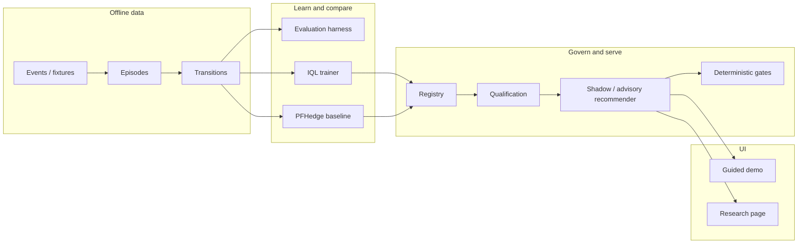

# Junior Developer Walkthrough — How This System Works End to End

This guide explains the **deep Bellman / PFHedge research subsystem** in plain language.
Read it top to bottom once, then use the [reading order](#12-file-reading-order) while you open files in the IDE.

Mathematical objects used in code (GBM, fee-once rewards, WIS, certainty equivalent,
quantile-Huber, IQL Bellman/actor losses, Polyak) are written in **LaTeX** under the
layers where they appear — especially [Layer 0](#layer-0--legacy-analytics-core-still-important),
[Layer 3](#layer-3--fee-once-rewards), [Layer 5](#layer-5--walk-forward-evaluation-and-ope),
and [Layer 6](#layer-6--two-different-smart-policies).

**What this product is:** an offline research stack for a sneaker market-making paper
trader. It builds training data from historical/synthetic (and now **paper-exported**)
replay, trains and compares policies (deterministic rules, PFHedge baseline, custom
IQL), and may *recommend* actions — but **deterministic risk gates always decide**
what the paper trader does. The research↔paper loop is **closed** on the living
roadmap (`docs/ROADMAP.md`: R0–R4 done). PFHedge stays research-comparison only
(ADR-0005). Live-send is still out of scope.

**What this product is not:** a live StockX/GOAT bot, a Cloudflare bypass, or an
auto-approved trading agent.

For the **Continuous Paper Market-Maker** Ops path (golden replay → Strategy Mode →
Gate → fills), use [`docs/paper-ops/`](../paper-ops/README.md) — separate from this
research walkthrough and from the Guided Demo.

---

## Big picture in one paragraph

Replay events are turned into **episodes** (14-day decision schedules). Each decision
gets an encoded **state**, a **fee-once reward**, and an **offline transition** row
(the RL training sample). Those rows are evaluated under **frozen assumptions**
through one shared harness (all policy types). Custom **IQL** trains offline;
**PFHedge** is a separate direct-hedging baseline. Models enter an immutable
**registry**. In **shadow** mode the model is scored but paper commands stay
byte-identical to deterministic-only. Only after explicit human **qualification +
approval** can **advisory** mode suggest gated model actions. The React **guided
demo** plays a fixed six-beat story so you can see the whole loop without a network.



---

## Mental model: three “worlds”

| World | Question it answers | Where in code |
|-------|---------------------|---------------|
| **Accounting / paper trading** | How much cash/NAV/inventory after fees? | `core.py`, `rewards/`, demo fixtures |
| **Learning (offline RL)** | Given past decisions, how should a policy update? | `iql/`, `evaluation/`, `transitions/` |
| **Serving / governance** | May this model change paper commands? | `registry/`, `qualification/`, `serving/`, `api/` |

Juniors often mix these up. A model can score well in learning and still never
touch paper commands until registry + gates say so.

---

## Layer 0 — Legacy analytics core (still important)

Before the research stack existed, the repo already had fee-aware opportunity
evaluation.

| File | Job |
|------|-----|
| `src/sneaker_market_maker/core.py` | `Decimal` money, fee schedules, risk limits, `OpportunityEvaluator` |
| `src/sneaker_market_maker/pipeline.py` | Marketplace-shaped JSON → validated `MarketSnapshot` |
| `src/sneaker_market_maker/simulation.py` | Seeded GBM paths (analytics only, not accounting) |

**Rule:** money uses `Decimal`. NumPy/tensors are for analytics or ML boundaries,
not for ledger math.

### Holding-period stress (GBM)

For analytics stress only (`simulation.py`), price paths are generated with
vectorized log-returns (no Python loops over time/path). Under GBM,

\[
\mathrm{d}S_t = \mu S_t\,\mathrm{d}t + \sigma S_t\,\mathrm{d}W_t,
\]

the discrete Euler step used in code is

\[
\log S_{t+\Delta t}
=
\log S_t
+ \Bigl(\mu - \tfrac12\sigma^2\Bigr)\Delta t
+ \sigma\sqrt{\Delta t}\,Z_t,
\quad
Z_t\sim\mathcal{N}(0,1),
\]

with \(\Delta t = 1/N_{\mathrm{year}}\). Discrete restock/hype shocks are applied
afterward as multiplicative jumps \(S \leftarrow S(1+\delta)\) from a chosen period
onward — not as continuous Brownian increments. **Missing ticks / holidays** must
be represented as explicit gaps or coalesced maintenance decisions in the episode
builder; do not invent mid-holiday prints.

---

## Layer 1 — From events to episodes

**Goal:** turn a stream of marketplace-like events into a fixed schedule of
*decision points* the agent (or a human rule) must answer.

```text
NormalizedEvent  →  EpisodeBuilder.build()  →  Episode(decisions=[DecisionPoint, ...])
```

| File | What to notice |
|------|----------------|
| `research/episodes/events.py` | Event kinds (book, fill, fee, restock, …) and `DecisionPoint` shape |
| `research/episodes/builder.py` | 14-day horizon, material events, coalesced 60-second maintenance ticks |

Each `DecisionPoint` carries roughly: time, state snapshot, legal action mask,
bounds, and provenance (`historical` vs `synthetic`). Synthetic data must never
pollute a historical holdout claim later.

**Analogy:** an episode is a film reel; each decision is a frame where someone must
choose NO_OP / QUOTE / CANCEL (and continuous quote parameters).

---

## Layer 2 — State encoding and legal actions

**Goal:** convert rich Python state into tensors + tell the policy what is legal.

| File | Types / functions |
|------|-------------------|
| `research/encoding/schema.py` | `StateEncoder.encode()`, `MaskBuilder.build()`, train-only `Scaler` |
| `research/contracts/action.py` | `HybridAction`, `RawHybridAction`, `canonicalize_action()` |
| `research/contracts/state.py` | Versioned state schema markers |

Hybrid action = **category** (`NO_OP` / `QUOTE` / `CANCEL`) + continuous fields
(allocation, bid/ask offsets). Canonicalization clamps/rounds into bounds and
respects the mask. Gates and training both expect this canonical form.

---

## Layer 3 — Fee-once rewards

**Goal:** every transition reward matches NAV change after counting each cost
exactly once (seller fee, processor, shipping, …).

| File | Types / functions |
|------|-------------------|
| `research/rewards/builder.py` | `RewardBuilder.build()`, ledger reconciliation |

Let \(\mathrm{NAV}_t\) be mark-to-market net asset value and \(N_0\) the configured
initial NAV. The dimensionless NAV increment is

\[
\Delta\mathrm{nav}_t
=
\frac{\mathrm{NAV}_{t+1}-\mathrm{NAV}_t}{N_0}.
\]

Weighted penalties (age, capital, turnover, drawdown, stale, and terminal
liquidation when \(d_t=1\)) enter as

\[
r_t
=
\Delta\mathrm{nav}_t
-
\sum_k \lambda_k\,p_{t,k}.
\]

Explanatory costs (seller / processor / shipping / authentication / slippage) are
reconciled to **append-only ledger entry IDs** so each dollar of friction appears
once. If a fee is double-counted or a terminal step leaves open lots/reservations,
reward learning is lying. Tests in `tests/research/rewards/` catch that.

---

## Layer 4 — Offline transitions (the RL dataset row)

**Goal:** build one immutable training sample per decision step.

```text
DecisionPoint_t + DecisionPoint_{t+1}
        + proposed action + post-gate action
        + reward + behavior propensities
        → OfflineTransition
```

| File | Types / functions |
|------|-------------------|
| `research/contracts/transition.py` | `OfflineTransition`, `validate_trainable()` |
| `research/transitions/service.py` | Assemble, hash, quarantine, persist |
| `persistence/research_repository.py` | In-memory or Postgres append-only store |

Important fields for juniors:

- **proposed_action** vs **post_gate_action** — the model/human suggestion vs what
  actually would run after risk gates.
- **behavior** propensities — needed for honest offline policy evaluation (OPE).
- **trainability_status** — `quarantined` rows are excluded from training with a
  reason count (see IQL dataset).
- **content_hash / provenance** — corrections append versions; they do not rewrite
  history.

Discount \(\gamma_t\) on each row is computed from elapsed simulation time at
assembly (never from future episode length). Together with reward \(r_t\) and
terminal flag \(d_t\), this is exactly the \((s,a,r,s',d,\gamma)\) tuple IQL
consumes.

---

## Layer 5 — Walk-forward evaluation and OPE

**Goal:** compare policies fairly without leaking future information, and refuse
to claim OPE when support is incomplete.

| File | Job |
|------|-----|
| `research/evaluation/splits.py` | Chronological folds; block synthetic→historical leakage |
| `research/evaluation/harness.py` | One frozen path for *all* policy types |
| `research/evaluation/metrics.py` | Bootstrap confidence intervals |
| `research/evaluation/ope.py` | Support diagnostics; WIS only if fully valid |
| `research/policies/baselines.py` | Deterministic / heuristic / MLP adapters |

**Frozen assumptions** (`FrozenAssumptions` in `ports.py`) pin fee/slippage/gate
versions so two policies see the same world. If OPE is not valid, the UI must show
**“OPE not valid”** — never invent a number.

### No look-ahead (walk-forward)

A fold with train window \([t_0,t_{\mathrm{cut}})\) and holdout \([t_{\mathrm{cut}},t_1]\)
must satisfy: scalers, policies, and metrics for the holdout use **only**
information with timestamps \(< t_{\mathrm{cut}}\). Synthetic episodes never enter a
historical holdout claim. Referencing \(S_{t+k}\) or labels from the future when
deciding at \(t\) is look-ahead bias — banned in `splits.py` tests.

### Offline policy evaluation (WIS)

When (and only when) support is full and propensities are trustworthy, weighted
importance sampling estimates the evaluation policy value from logged returns
\(G_i\):

\[
w_i
=
\frac{\pi_e(a_i\mid s_i)}{\pi_b(a_i\mid s_i)}
=
\exp\bigl(\log\pi_e-\log\pi_b\bigr),
\qquad
\widehat{V}_{\mathrm{WIS}}
=
\sum_i \tilde{w}_i\,G_i,
\quad
\tilde{w}_i
=
\frac{w_i}{\sum_j w_j}.
\]

Effective sample size:

\[
\mathrm{ESS}
=
\Bigl(\sum_i \tilde{w}_i^2\Bigr)^{-1}.
\]

If any action lacks support, propensities are missing/zero, or behavior is
deterministic, the code returns `OPE_NOT_VALID` instead of a fake number
(`ope.py`).

---

## Layer 6 — Two different “smart” policies

### A. PFHedge baseline (not Bellman)

| File | Job |
|------|-----|
| `research/pfhedge/adapter.py` | Direct entropic-risk hedging baseline |

PFHedge 0.23.0 is an **independent** comparison track. It does **not** own IQL
losses, Bellman targets, registry promotion, or gates. Docs and UI label it
“Direct hedging baseline.”

Given terminal PnL random variable \(X\), the entropic risk measure with
aversion \(a>0\) (as used by `EntropicRiskMeasure`) is of the form

\[
\rho_a(X)
=
\frac{1}{a}\log\mathbb{E}\bigl[e^{-a X}\bigr]
\]

(up to the library’s sign/target convention). The trainer minimizes this risk on
simulator PnL after the shared fee/slippage/logistics path — a **terminal**
objective, not a Bellman backup.

### B. Custom distributional IQL (Bellman path)

Training pipeline, in order:

```text
TransitionDataset  →  TransitionBatch
       ↓
IQLTrainer.step():
  1) update Value  (expectile + CE, logged actions only)
  2) update Q1/Q2  (distributional Bellman target)
  3) update Actor  (advantage-weighted log-prob)
  4) Polyak targets (only after successful steps)
       ↓
CheckpointStore (safetensors + manifest.json)
```

| File | Job |
|------|-----|
| `research/iql/math.py` | Certainty equivalent, quantile-Huber, crossing loss |
| `research/iql/networks.py` | Distributional V / twin Q, conservative selection |
| `research/iql/actor.py` | Masked categorical + squashed continuous density |
| `research/iql/trainer.py` | Ordered updates + detached targets + grad clip |
| `research/iql/dataset.py` | Load trainable rows; exclusion reason counts |
| `research/iql/checkpoint.py` | Safe load/save; **no** `pickle` / `torch.load` |

#### Certainty equivalent (risk-sensitive scalarization)

For quantile atoms \(z_1,\ldots,z_m\) and risk aversion \(\eta\ge 0\):

\[
\mathrm{CE}_\eta(z)
=
\begin{cases}
\dfrac{1}{m}\sum_j z_j, & \eta=0, \\[0.75em]
\dfrac{1}{m}\sum_j z_j
-
\dfrac{\eta}{2m}\sum_j
\bigl(z_j-\bar z\bigr)^2, & 0<\eta\ll 1, \\[0.75em]
-\dfrac{1}{\eta}
\log\Bigl(\dfrac{1}{m}\sum_j e^{-\eta z_j}\Bigr), & \text{otherwise.}
\end{cases}
\]

Twin critics are reduced conservatively by choosing the twin with smaller CE:

\[
Q^{\mathrm{cons}}(s,a)
=
\begin{cases}
Q_1(s,a), & \mathrm{CE}_\eta(Q_1)\le \mathrm{CE}_\eta(Q_2), \\
Q_2(s,a), & \text{otherwise.}
\end{cases}
\]

#### Smooth Huber and pairwise quantile-Huber

\[
\ell_\kappa(u)
=
\begin{cases}
\tfrac12 u^2, & |u|\le\kappa, \\
\kappa\bigl(|u|-\tfrac12\kappa\bigr), & |u|>\kappa.
\end{cases}
\]

With predicted quantile levels \(\tau_i\) and targets \(y_j\),

\[
\mathcal{L}_{\mathrm{QH}}
=
\frac{1}{IJ}
\sum_{i,j}
\bigl|\tau_i-\mathbf{1}\{y_j<\hat q_i\}\bigr|
\;
\ell_\kappa(y_j-\hat q_i).
\]

Quantile crossing penalty: \(\mathcal{L}_{\times}=\mathbb{E}[\mathrm{ReLU}(\hat q_i-\hat q_{i+1})]\).

#### Distributional Bellman target (no bootstrap at terminal)

With discount \(\gamma_t\) stored on the transition and done flag \(d_t\in\{0,1\}\):

\[
y_t
=
r_t\cdot\mathbf{1}
+
\gamma_t\,(1-d_t)\,V_{\theta^-}\!\bigl(s_{t+1}\bigr),
\]

where \(V_{\theta^-}\) is the Polyak target value network (quantile vector). At
\(d_t=1\), the bootstrap term is exactly zero.

#### Expectile value update (logged actions only)

Let \(\tilde Q = Q^{\mathrm{cons}}_{\theta^-}(s_t,a_t^{\mathrm{logged}})\) and
\(\delta=\mathrm{CE}_\eta(\tilde Q)-\mathrm{CE}_\eta(V_\theta(s_t))\). With expectile
level \(\tau\in(0,1)\),

\[
w(\delta)
=
\begin{cases}
\tau, & \delta\ge 0, \\
1-\tau, & \delta<0,
\end{cases}
\qquad
\mathcal{L}_V
=
\mathbb{E}\Bigl[
w(\delta)\Bigl(
\tfrac{1}{m}\sum_j \ell_\kappa\bigl(V_j-\tilde Q_j\bigr)
+
\lambda_{\mathrm{CE}}\,\delta^2
\Bigr)
\Bigr]
+
\lambda_{\times}\,\mathcal{L}_{\times}(V).
\]

#### Advantage-weighted actor

\[
A_t
=
\mathrm{CE}_\eta\!\bigl(Q^{\mathrm{cons}}_{\theta^-}(s_t,a_t)\bigr)
-
\mathrm{CE}_\eta\!\bigl(V_\theta(s_t)\bigr),
\qquad
\omega_t
=
\min\Bigl(
e^{\mathrm{clip}(\beta A_t,\,[-c,c])},\,
\omega_{\max}
\Bigr),
\]

\[
\mathcal{L}_\pi
=
-\mathbb{E}\bigl[
\omega_t\,\log\pi_\phi(a_t^{\mathrm{logged}}\mid s_t)
\bigr].
\]

The hybrid density factors as masked categorical posture times squashed
Gaussian continuous controls (allocation via sigmoid, offsets via affine-tanh)
with exact change-of-variable Jacobians (`actor.py`).

#### Polyak target update

\[
\theta^-
\leftarrow
(1-\tau)\,\theta^-
+
\tau\,\theta
\quad\text{(only after a successful optimizer step, on cadence).}
\]

**Junior pitfall:** IQL fits on **logged** (behavior) actions. Do not silently
bootstrap with on-policy samples as if this were online RL.

---

## Layer 7 — Registry and advisory qualification

Models do not “go live” when training finishes.

```text
CANDIDATE → VALIDATED → SHADOW → BENCHMARK_QUALIFIED → ADVISORY_APPROVED
                ↘ REJECTED          ↘ ROLLED_BACK
```

| File | Job |
|------|-----|
| `research/registry/service.py` | Immutable register + legal transitions + audit log |
| `research/qualification/service.py` | Evaluate frozen benchmark criteria; explicit `approve()` |
| `docs/research/advisory-qualification.md` | Policy: code ≠ approval |

`approve()` requires:

1. Fully qualified report  
2. Registry state `BENCHMARK_QUALIFIED`  
3. Matching artifact hash  
4. Human confirmation text containing **both** artifact hash and policy version  

Until then, serving stays deterministic-only or shadow.

---

## Layer 8 — Recommendation serving (where gates win)

```text
RecommendationRequest
  → canonicalize selected model action (if any)
  → GatePort.evaluate(...)
  → if SHADOW: final = deterministic   (always)
  → if ADVISORY_APPROVED and gates pass: final = candidate
  → else: final = deterministic
  → persist comparison record
```

| File | Job |
|------|-----|
| `research/serving/recommender.py` | Shadow vs advisory control flow |

**Invariant:** in shadow mode, the serialized paper command stream must be
**byte-equivalent** to deterministic-only, while still storing model comparisons
for research.

**Invariant:** advisory cannot reverse a deterministic gate rejection.

---

## Layer 9 — Local API and frontend

### FastAPI (`api/`)

| File | Job |
|------|-----|
| `api/app.py` | Compose app; default bind `127.0.0.1` |
| `api/research_routes.py` | Reads + idempotent commands; reject huge / code-shaped payloads |
| `api/research_events.py` | Ordered WebSocket event envelopes |

No marketplace credentials. No execution endpoints. External bind requires an
injected auth dependency.

### React (`frontend/`)

| Entry | What you see |
|-------|----------------|
| `http://127.0.0.1:5173/` | **Guided demo** (fixture-only, no fetch) |
| `http://127.0.0.1:5173/?view=research` | Research comparison page (needs API) |
| `http://127.0.0.1:5173/?view=ops` | **Ops Dashboard** — Continuous Paper Market-Maker (see [`docs/paper-ops/`](../paper-ops/README.md)) |

| File | Job |
|------|-----|
| `frontend/src/research/GuidedDemo.tsx` | Pause / resume / step / restart six beats |
| `frontend/src/research/demoService.ts` | TypeScript mirror of Python demo fixtures |
| `frontend/src/research/ResearchPage.tsx` | Assumptions, tracks, registry, recommendation trace |
| `frontend/src/research/api.ts` | Fail closed to “deterministic-only” if API missing |

### Guided demo story (300 simulation seconds)

| Second | Beat | What it teaches |
|-------:|------|-----------------|
| 0 | `healthy_spread` | Idle watching the book |
| 60 | `deterministic_bid` | Deterministic quote opens; IQL shadow may differ |
| 120 | `paper_buy_fill` | Cash drops; inventory in logistics |
| 180 | `shipping_authenticated` | Auth complete; NAV mark moves |
| 240 | `inventory_ask_sale` | Sale + itemized fees; realized P&L |
| 300 | `risk_gate_rejection` | Models want another quote; **final = NO_OP** |

---

## Layer 10 — Safety net (do not break these)

Automated in `tests/safety/`:

1. No `requests` / `aiohttp` / marketplace SDKs in research code  
2. No Cloudflare / CAPTCHA / TLS-fingerprint / proxy-rotation language  
3. No credential env scraping for live trading  
4. No `pickle.load` / unsafe model code upload paths  
5. Socket `connect` denied during research smoke tests  
6. GuidedDemo still works when `fetch` throws  

Also always true by design:

- **Decimal** for money  
- **Gates authoritative** after any model suggestion  
- **Shadow ≠ advisory**  
- **Advisory never auto-approved by shipping code**

---

## End-to-end scenario (trace one decision)

Imagine second 60 of the demo / a similar historical decision:

1. **Episode builder** emits a `DecisionPoint` with mask allowing `QUOTE`.  
2. **Deterministic policy** proposes a conservative bid quote.  
3. **IQL / PFHedge** (in shadow) produce alternative raw actions.  
4. **Canonicalize** clamps ticks into bounds.  
5. **Gates** check capital, fees, inventory, exposure, schema, …  
6. **Recommender** in `SHADOW` sets `final_action = deterministic_action` even if
   IQL wanted a larger allocation.  
7. Paper stream records only the deterministic command. Comparison row still
   stores PFHedge/IQL for the research UI.  
8. Later, if someone tries `ADVISORY_APPROVED` without qualification, registry
   and qualification services refuse.

That single path is the whole product thesis: **learn offline, compare honestly,
shadow safely, promote only with human evidence.**

---

## 12-file reading order

Open these in order; skim tests beside each file if stuck.

| # | File | Why |
|---|------|-----|
| 1 | `README.md` | Intent and Decimal / no-live-orders stance |
| 2 | `research/episodes/events.py` | Vocabulary of decisions |
| 3 | `research/episodes/builder.py` | How episodes are scheduled |
| 4 | `research/encoding/schema.py` | Tensors + masks |
| 5 | `research/rewards/builder.py` | Fee-once NAV reward |
| 6 | `research/contracts/transition.py` | The offline RL row |
| 7 | `research/transitions/service.py` | Assemble + quarantine |
| 8 | `research/evaluation/harness.py` | Fair policy comparison |
| 9 | `research/iql/trainer.py` | IQL update ordering |
| 10 | `research/registry/service.py` | Promotion state machine |
| 11 | `research/serving/recommender.py` | Shadow / advisory / gates |
| 12 | `frontend/src/research/GuidedDemo.tsx` | User-visible story |

**Bonus:** `tests/safety/test_offline_boundary.py` — the automated “don’t ship a
marketplace client” contract.

---

## How to run things locally

Step-by-step research exercise runbook (pytest ladder + UI lab):
[`docs/research/exercise-pipeline.md`](./exercise-pipeline.md).

```bash
# From repo root (venv activated)
# Python tests (importlib avoids duplicate test_service.py module names)
.venv/bin/python -m pytest -m "not integration" -q --import-mode=importlib

# Guided demo UI
cd frontend && npm run dev
# open http://127.0.0.1:5173/
```

Acceptance evidence for the full subsystem lives in
`docs/research/acceptance-checklist.md` (AC-01 … AC-14).

---

## Common junior questions

**Q: Where do I add a new fee?**  
A: Accounting path (`RewardBuilder` + ledger IDs) and any demo fixtures that
itemize fees. Never only change a float in a tensor.

**Q: Where do I add a new model architecture?**  
A: New module under `research/`, wrap as `EvaluationPolicy`, train offline, save
via safetensors allowlist, register with `CompatibilityContract`. Do not add
`torch.load` of arbitrary pickles.

**Q: Why did my model’s action not appear in the paper stream?**  
A: You are probably in `SHADOW`, or gates rejected the candidate, or the model is
not `ADVISORY_APPROVED`. Check `RecommendationRecord.fallback_reason`.

**Q: Can I call StockX from a unit test?**  
A: No. Use fixtures. Safety tests will fail the PR if you import HTTP marketplace
clients into research code.

---

## Where to go next

- Design rationale: `docs/superpowers/specs/2026-07-17-deep-bellman-pfhedge-design.md`  
- Implementation task history: `docs/superpowers/plans/2026-07-17-deep-bellman-pfhedge.md`  
- Advisory rules: `docs/research/advisory-qualification.md`  
- PFHedge pin notes: `docs/compatibility/pfhedge-0.23.0.md`
