# Senior Architect Walkthrough — Intuition, Problem, Tools, Math

**Who this is for:** Engineers and research leads who want *why* before *where*.  
**Product:** A StockX-first **sneaker market-making system** — paper Ops + offline learning + live readiness.  
**Hard rules:** Deterministic Gate always final. **No live order send** until ADR-0004 + human enable. No marketplace protection bypass.

**Progress:** Research↔paper loop closed (R0–R4). L1 read-only observe shipped. Live-send still gated — see [`../ROADMAP.md`](../ROADMAP.md).

**Companions:** [`QUANTITATIVE_CONTEXT.md`](./QUANTITATIVE_CONTEXT.md) (full math) · [`../MASTER.md`](../MASTER.md) (product map) · [`exercise-pipeline.md`](./exercise-pipeline.md) (run tests)

---

## SECTION 0: THE INTUITION IN ONE PAGE

### The problem you are trying to solve

On StockX-shaped sneaker markets, a naive “buy low, sell high” story fails for three reasons:

1. **Fees eat the spread.** Seller % + processor % + shipping + fixed fees can turn a \$50 gross spread into a tiny or negative net.  
2. **Inventory is physical.** You hold a real pair (qty one), wait on shipping/auth, and can get stuck if the ask moves against you.  
3. **Decisions are sequential and offline.** You cannot freely explore live markets. You must learn from logged paper/history under risk rules that never get bypassed.

**Your goal:** Build a **market-making system** for sneaker secondary markets that
quotes both sides, respects capital and allowlists, prices friction exactly, and
improves risk-adjusted NAV — first under paper replay, then via offline RL (IQL)
that suggests actions but never overrides hard gates, and eventually under a
gated live-readiness path (observe → shadow → ADR-0004 send).

Paper is how we prove the DNA safely; it is not the product ceiling.

### The tools you use to solve it

| Problem slice | Tool |
|---------------|------|
| Messy marketplace JSON | `SneakerDataPipeline` → `MarketSnapshot` (fail-closed, Decimal) |
| Exact fee / breakeven math | `FeeSchedule` |
| “Is this opportunity even legal?” | `OpportunityEvaluator` + `RiskLimits` |
| Turn history into RL episodes | `EpisodeBuilder`, `StateEncoder`, `Scaler`, `MaskBuilder` |
| Score “what happened after we acted” | `RewardBuilder` (fee-once NAV + penalties) |
| Store Bellman training rows | `TransitionAssembler` / `OfflineTransition` |
| Learn a policy from logs only | Distributional **IQL** (`IQLTrainer`) |
| Fair baseline comparison | Deterministic / heuristic / MLP / **PFHedge 0.23.0** + `EvaluationHarness` |
| Continuous paper quoting | Quote Engine + Strategy Modes + **Deterministic Gate** + Paper Capital / Lots |
| Close the loop | `export-from-run` → retrain mix → registry promote → Ops `bind-model` |
| Serve models safely | `RecommendationService` + `RegistryService` (shadow → advisory); Ops promote/bind |
| Live readiness (no send) | `observe` read-only port (L1) |

### Worked toy (same numbers as `tests/test_core.py`)

Fees: seller \(10\%\), processor \(3\%\), inbound shipping \$8, outbound \$2.

| Step | Numbers | Meaning |
|------|---------|---------|
| Buy at \$100 | Cost \(= 100 + 8 =\) **\$108.00** | Cash out to get the pair in |
| Sell at \$150 | Proceeds \(= 150(1-0.10-0.03) - 2 =\) **\$128.50** | Cash in after friction |
| Net | \(128.50 - 108.00 =\) **\$20.50** | Real profit, not the \$50 gross spread |
| Breakeven sale | **\$126.44** | Any ask below this loses money after fees |

Gross spread looked like \$50. Fee-honest profit is \$20.50. That gap is why this repo exists.

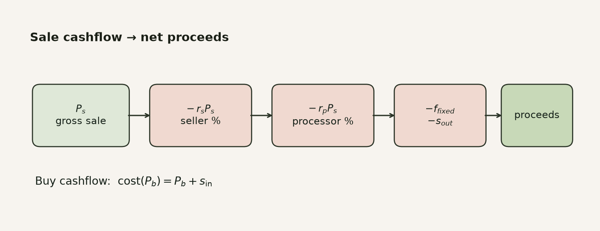

---

## SECTION 1: PROBLEM STATEMENT (DEEPER)

### 1.1 What “market making” means here

A market maker posts:

- a **bid** (willing to buy), and  
- an **ask** (willing to sell),  

and tries to earn the spread while managing inventory risk.

On sneakers (StockX-shaped), you do not rebuild a full order book. You see **highest bid / lowest ask / recent sales** for a style+size. Paper fills follow deterministic rules against that replayed book. Asks are **inventory-backed**: no available lot ⇒ no sell quote.

Paper Capital starts at **\$2,500**. Open buy reservations are capped at **\$1,500** of that initial capital. Orders are **qty one** (one physical pair).

### 1.2 Failure modes you are defending against

| Failure | What goes wrong | How the system responds |
|---------|-----------------|-------------------------|
| Float money | \$0.01 drift compounds into fake P&L | Decimal money, quantized `ROUND_HALF_UP` |
| Corrupt market JSON | Silent zeros invent fake liquidity | `PayloadError` fail-closed |
| Model overrides risk | Ungated quotes blow capital | Deterministic Gate final under every Strategy Mode |
| Future leakage | RL “cheats” by seeing tomorrow | Past-only episode state; train-fold-only scaler fit |
| Double-counting fees | Reward overstates edge | Fee-once ledger in `RewardBuilder` |
| Silent IQL fallback in primary | You think the model ran; it did not | `iql_primary` **pauses** on invalid/late — no silent substitute |

### 1.3 Success looks like

Improve **risk-adjusted paper NAV** under fees, logistics, and capital limits — measured under a **frozen** evaluation harness — without live execution and without models approving their own risk.

---

## SECTION 2: MATH YOU ACTUALLY NEED

### 2.1 FeeSchedule — friction engine

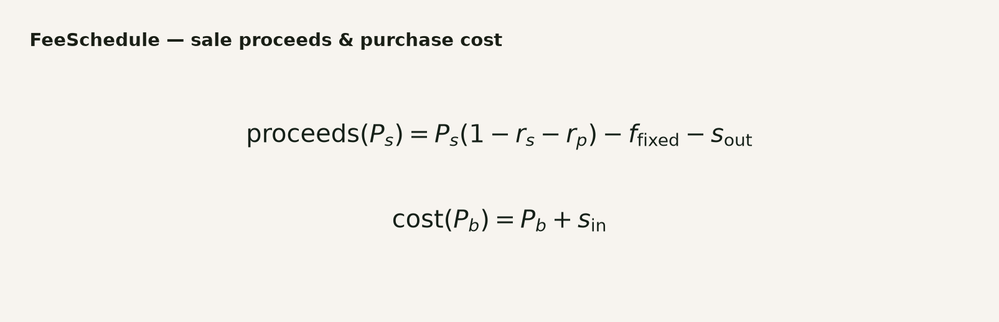

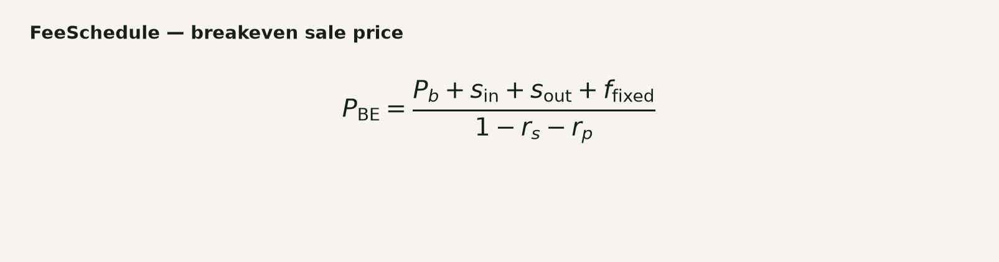

| Symbol | Meaning |
|--------|---------|
| \(P_s\), \(P_b\) | Gross sale / buy price |
| \(r_s\), \(r_p\) | Seller / processor rates |
| \(f_{\mathrm{fixed}}\) | Fixed seller fee (often \$0 in the toy fixture) |
| \(s_{\mathrm{in}}\), \(s_{\mathrm{out}}\) | Inbound / outbound shipping |

**Example A — profitable round trip**

\[
\begin{align*}
\mathrm{cost}(100) &= 100 + 8 = 108 \\
\mathrm{proceeds}(150) &= 150 \times 0.87 - 2 = 128.50 \\
\mathrm{net} &= 20.50
\end{align*}
\]

**Example B — looks green, is red**

Buy \$100 (cost \$108). Sell at \$120:

\[
\mathrm{proceeds}(120) = 120 \times 0.87 - 2 = 102.40
\quad\Rightarrow\quad
\mathrm{net} = 102.40 - 108 = -5.60
\]

Gross “+\$20” was still a loss after fees. Breakeven sale for a \$100 buy is **\$126.44**.

### 2.2 Opportunity signals


**Example:** bid \$100, ask \$150, \(\sigma_{48h}=5\)

\[
\mathrm{spread}=50,\qquad \mathrm{vol\_ratio}=5/100=0.05
\]

`OpportunityEvaluator` + `RiskLimits` turn these (plus sales count, etc.) into accept/reject with ordered reasons — before any model gets clever.

### 2.3 Reward — what “good” means for RL

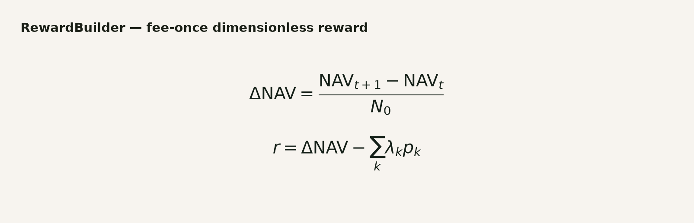

**Intuition:** reward ≈ how much paper NAV moved (normalized by starting NAV \(N_0\)), minus penalty terms for age, capital stress, turnover, drawdown, stale inventory, terminal liquidation.

**Example sketch:** \(N_0 = 2500\). NAV goes \(2500 \to 2520.50\) after a fee-honest sale, no penalties:

\[
\Delta\mathrm{NAV} = \frac{20.50}{2500} = 0.0082,\qquad r \approx 0.0082
\]

If fees were ignored and you credited the \$50 gross spread, reward would be wrong by more than \(2\times\). Fee-once accounting exists so IQL does not learn fantasy edge.

### 2.4 Bellman / IQL — learning from logs

You do not train by poking live StockX. You store transitions \((s,a,r,s',d)\) and learn offline.

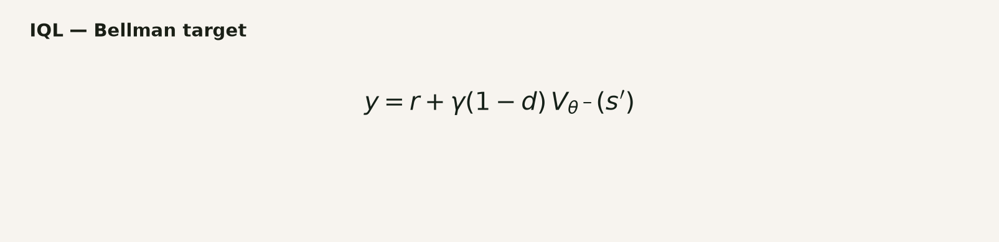

**Intuition:** “Today’s action is good if the immediate reward plus a discounted estimate of future value (unless done) looks good.”

IQL fits **only logged actions** (what actually happened), not arbitrary counterfactuals. Distributional IQL tracks a return *distribution*, then collapses it with a certainty equivalent:

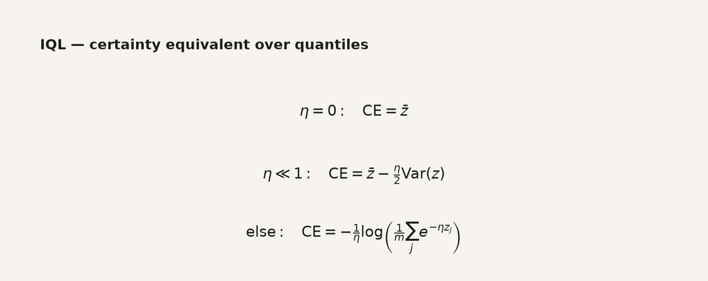

Actor prefers logged actions with high advantage (better than the state’s baseline), clipped so weights do not explode:

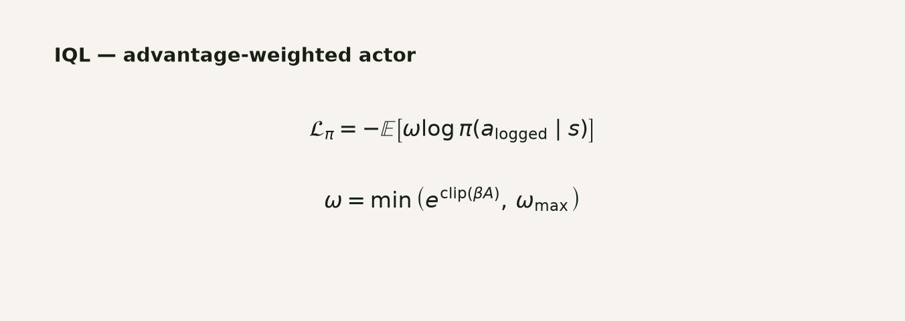

**Paper action example (from MASTER):** market touch \$220 / \$275, IQL says `QUOTE` with bid ticks \(+3\), ask ticks \(-3\), tick size \$1:

```text
→ candidate bid $223, ask $272
→ still must pass Deterministic Gate
→ ask only if an Inventory Lot is available
```

Advisory mode: deterministic base bid \$221, IQL nudges \(+2\) ticks → \$223; if IQL is late/invalid, keep \$221 that tick.

---

## SECTION 3: TOOLS MAPPED TO THE PIPELINE

### 3.1 Clean data in

Clean up messy external marketplace JSON into internal format. Weird/corrupt data blocks immediately (fail-closed). Pricing math stays decimal-honest.

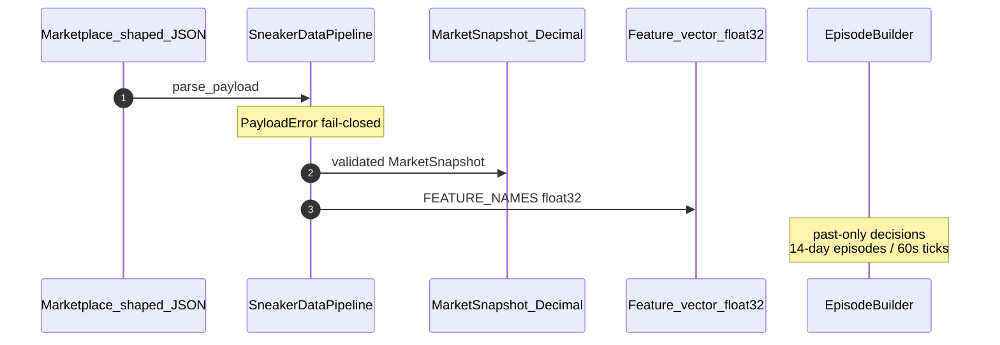

**Boundary:** Decimal on money; float tensors only after accounting settles — never float → money.

### 3.2 Suggest → gate → execute (paper)

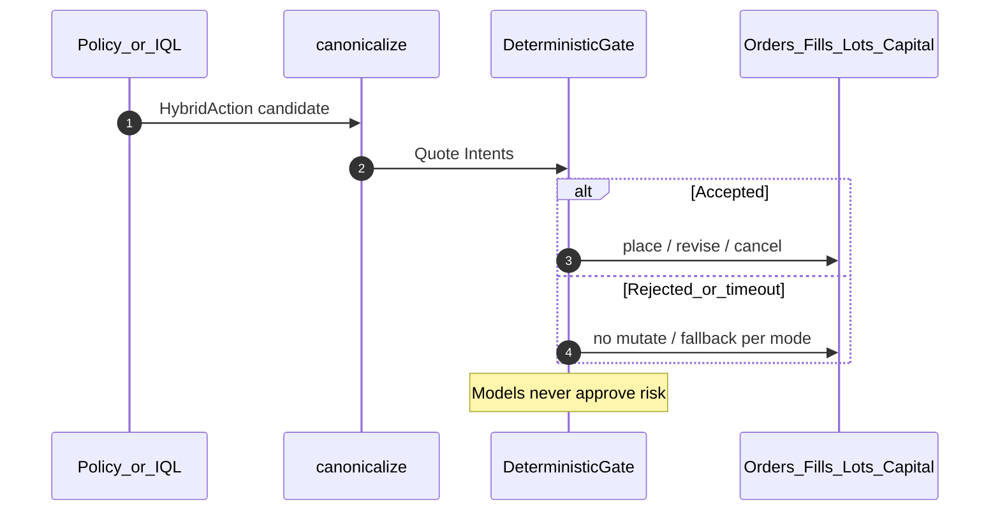

**Strategy Modes**

| Mode | Intuition |
|------|-----------|
| `deterministic` | Rules only; no IQL call |
| `advisory` | IQL nudges the deterministic base; bad/late → keep base |
| `iql_primary` | IQL authors intents; bad/late → **pause** (honest failure) |

### 3.3 Log → train → compare

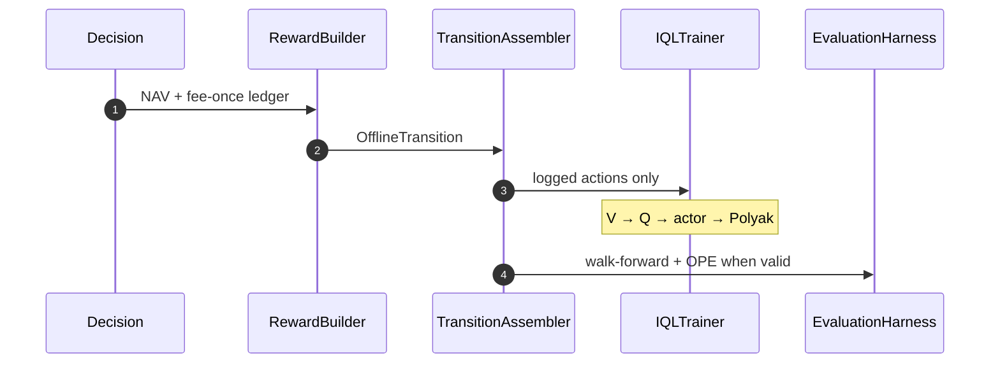

---

## SECTION 4: CLASS TOPOLOGY (WHO OWNS WHAT)

### 4.1 Research factory

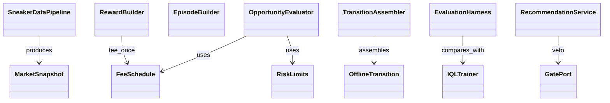

### 4.2 Paper Ops bridge

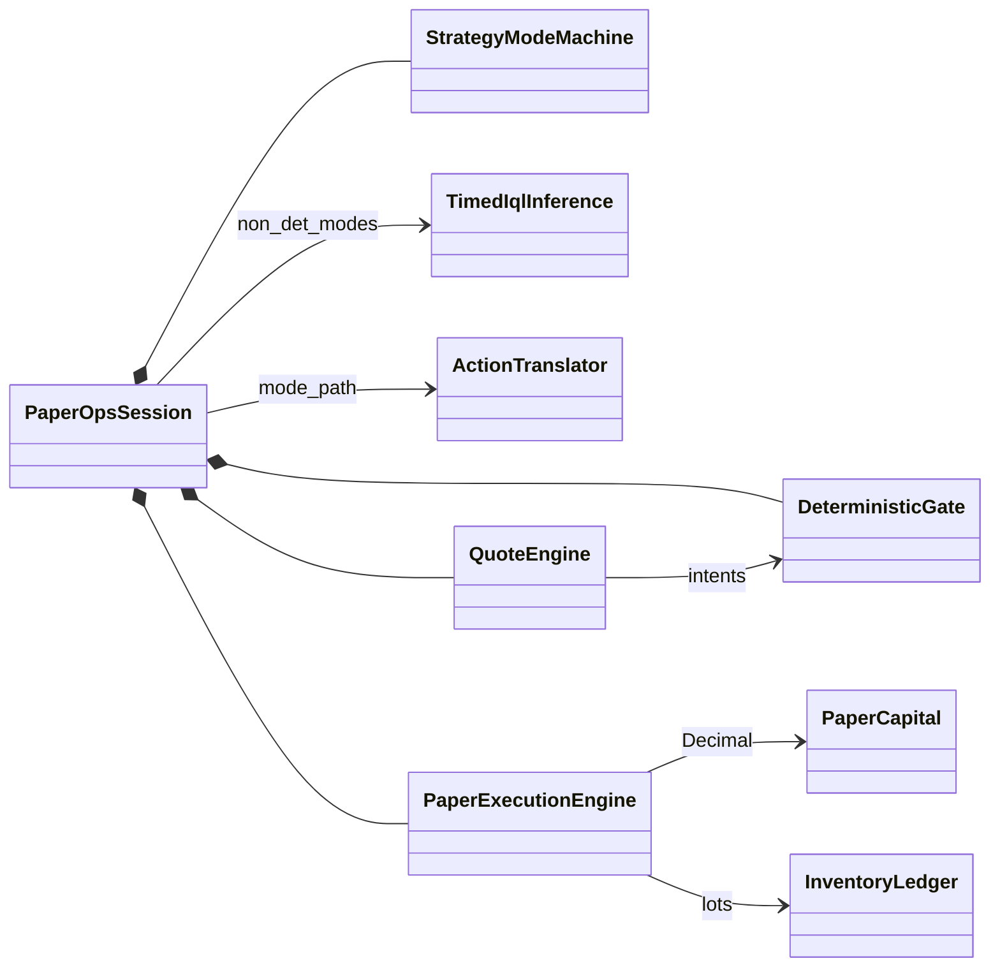

---

## SECTION 5: COMPONENT CHEAT SHEET

| Component | Problem it solves | Intuition |
|-----------|-------------------|-----------|
| `FeeSchedule` | Gross prices lie | Exact proceeds, cost, breakeven |
| `OpportunityEvaluator` | Not every wide spread is tradeable | Deterministic accept/reject |
| `SneakerDataPipeline` | Marketplace JSON is messy | Fail-closed normalize |
| `EpisodeBuilder` / encoder / scaler / mask | Need MDP states without leakage | 14-day past-only decisions |
| `RewardBuilder` | Need honest training signal | Fee-once \(\Delta\)NAV − penalties |
| Transitions | Need Bellman rows | Quarantine invalid; append-only |
| IQL | Learn from logs offline | Distributional value + advantage-weighted actor |
| PFHedge | Need a non-IQL baseline | Direct hedge compare only |
| Recommendation / Registry | Promote models safely | Shadow → advisory; immutable lineage |
| Gate / Quote / Execution | Paper MM must be capital-safe | Qty-one, Decimal capital, Gate final |

Full symbol / class inventory: [`QUANTITATIVE_CONTEXT.md`](./QUANTITATIVE_CONTEXT.md).

---

## SECTION 6: HOW WE PROVE IT

### 6.1 Fee honesty

| Suite | Proves |
|-------|--------|
| `tests/test_core.py` | \$150 sale → \$128.50 proceeds; \$100 buy → \$108 cost; net \$20.50; BE \$126.44 |
| `tests/research/rewards/test_builder.py` | Fee-once NAV; ledger monotonic |
| `tests/paper/` fill tests | Fee-aware fills update Decimal capital |

Assert money as strings (`"221.00"`), never float equality.

### 6.2 Risk cannot be bypassed

| Suite | Proves |
|-------|--------|
| `tests/research/serving/test_recommender.py` | Shadow identity; advisory reject → deterministic |
| `tests/paper/test_deterministic_gate.py` | Capital / allowlist / inventory rejects |
| `tests/api/test_paper_ops_strategy_modes.py` | Mode rules; iql_primary pause |
| `tests/safety/` | No marketplace clients; network deny |

### 6.3 Offline MDP integrity

| Suite | Proves |
|-------|--------|
| Episode / split / harness / OPE / transition / IQL tests | No leakage; frozen hashes; OPE invalid when support fails; logged-action fitting |

Run path: [`exercise-pipeline.md`](./exercise-pipeline.md).

---

## Appendix — Document map

| Need | Doc |
|------|-----|
| This walkthrough | `docs/research/senior-architect-walkthrough.md` |
| Exhaustive math | `docs/research/QUANTITATIVE_CONTEXT.md` |
| Junior narrative | `docs/research/junior-walkthrough.md` |
| Product front door | `docs/MASTER.md` |
| Living roadmap | `docs/ROADMAP.md` |
| Paper Ops | `docs/paper-ops/` |
| Observe-only (L1) | `docs/observe/` |
| PFHedge deferred | `docs/adr/0005-pfhedge-paper-mode-deferred.md` |

**Out of scope (today):** live StockX/GOAT **order** send without ADR-0004, ungated model trading, anti-bot evasion, treating synthetic stress as historical proof, float money in ledgers. Live readiness (observe → shadow → gated send) is **in product scope** via Track L.
